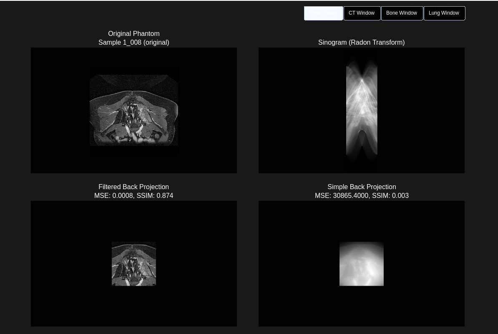
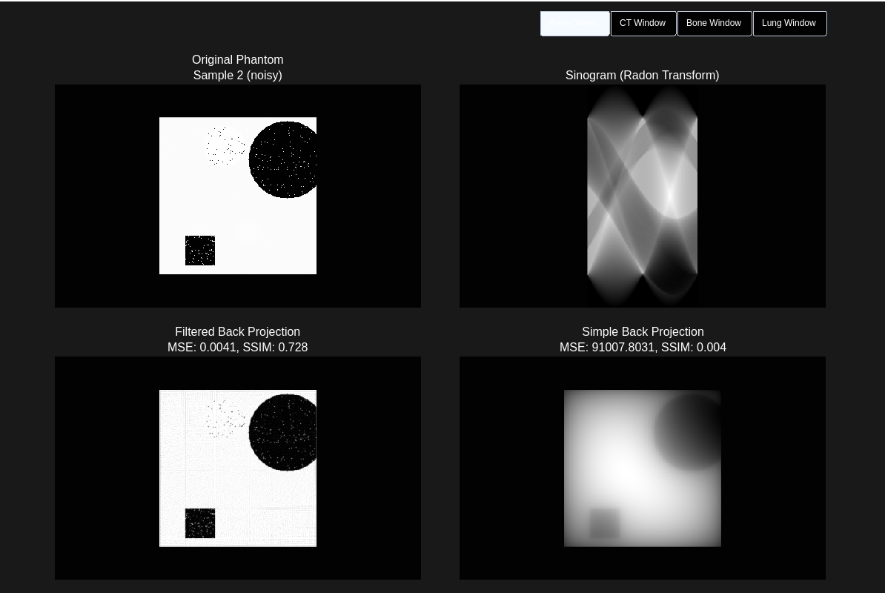

# 🧬 Simple Radon Transform Study

This project applies the Radon Transform in medical imaging, focusing on synthetic CT scan generation, sinogram computation, and image reconstruction. It includes filtered and simple back projection methods and evaluates reconstruction quality using various metrics.

 

## Features

- **Synthetic Data Generation**: Create CT phantoms with random shapes and noise.
- **Radon Transform**: Compute sinograms.
    - Optional custom implementation
- **Image Reconstruction**: Perform filtered and simple back projections.
    - Optional custom implementation
- **Metrics Calculation**: Evaluate reconstruction quality using MSE, PSNR, and SSIM.
- **Visualization**: Visualize images with Plotly and Matplgotlib.

## Usage

### Get Data

```bash
python3 main.py --generate # to generate
python3 main.py --download # to download real data
```

### Process a Specific Sample

To process a sample by its ID:

```bash
# Process synthetic sample 2
python main.py --process 2 --data-type synthetic

# Process real samples
python main.py --process 1_008 --data-type real
python main.py --process 2b_001 --data-type real
```

- Result on ``--process 2 --data-type synthetic``
    - 

## Dependencies

- Python 3.8+
- NumPy
- SciPy
- scikit-image
- Plotly
- Matplotlib
- pydicom

## DICOM data

- https://www.visus.com/en/downloads/jivex-dicom-viewer.html
    - Implemented